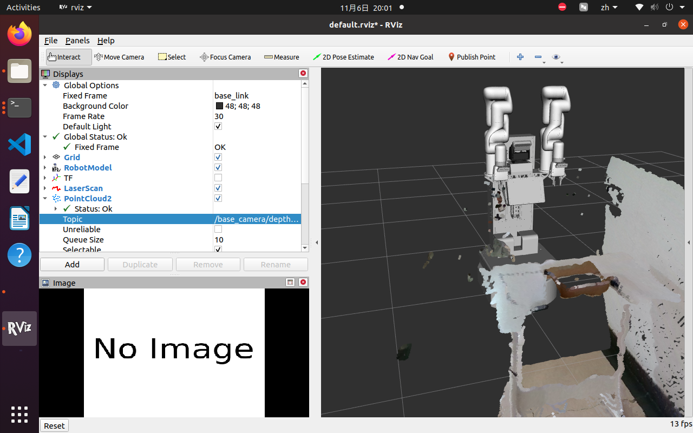

============================
增量式导航算法调试
============================

1. 普通增量式导航调试
=====================

问题记录:
------------

1.1 机器人上的/odom没有角速度和线速度反馈
^^^^^^^^^^^^^^^^^^^^^^^^^^^^^^^^^^^^^^^^^

**解决方法：**

在机器人上厂家对 **/odom** 节点进行了重映射为 **/ir100/ir100_velocity_controller/odom**

2. 基于视觉的增量式导航调试
==============================

实现步骤：
    1. 摄像头获取到RGB图像和深度图像
    2. RGB图像送入感知器中获取桌子的目标识别框
    3. 根据识别框确认桌子的像素坐标
    4. 结合深度图将像素坐标转换为现实世界坐标
    5. 现实世界坐标移动机器人

**两张桌子的检测和机器人移动：**

实现逻辑：
    视觉检测两张桌子并获取相应的mask，判断目标在图像的左右确定是否为第一张桌子。

**从第一张桌子移动到第二张桌子：**

实现逻辑：

方案一：由于桌子摆放固定，可直接通过固定路线移动。
方案二：基于视觉检测：起始点处分别获取两张桌子的基于起始点的空间三维坐标点并保存，在第一张桌子处对第二张桌子进行坐标转换获取基于第一张桌子的空间三维坐标点。

**从第二张桌子移动到第一张桌子：**

实现逻辑：
    与上述相似。

**回归起始点：**

每次移动后更新出发点相对当前位置的坐标和角度并保存记录。

3. 获取桌子斜率调试
=====================

此问题考虑了两种方案：

**方案一：**

第一步：使用深度信息去获取一部分像素点能完整覆盖桌子边缘从左侧到右侧，取的前n个最小深度点需要根据实际倾斜角度调整。

第二步：取左右两侧两个点，转换成三维坐标并计算出斜率。

第三步：根据左右两点计算出中点和其对应的深度值。

第四步：过中点做与桌面垂直的法线，在法线上找出与中点距离0.5m的坐标点。

第五步：移动到坐标点，再旋转，并移动到桌子前。

**方案二：**

该方案采用opencv边缘检测，并结合直线检测找出斜率。

4. 导航到桌子附近的局部微调
===========================

机器人运动到桌子面前后如果没有没有目标或目标不在视野中的处理。

第一步：用头部相机检测目标，获取目标中心点像素坐标，并判断是否在视野中心

第二步：如果没有目标，先向左旋转30度，检测目标，如果没有目标，回正，向右旋转30度，检测目标，如果还是没有，左右旋转45度，重复操作，45度如果没有，返回报错。

第三步：识别到目标后计算中心点是否在抓取范围内。

第四步：如果不在范围内，计算与抓取范围的偏差。

第五步：移动到机械臂可抓取范围。

第六步：向前移动到距离桌子0.35m，将当前位置设置为桌子1的坐标，更新其他点位坐标。

5. PCL算法测试
===========================

首先创建一个ROS目录包:

.. code-block:: shell
    :linenos:

    catkin_create_pkg my_pcl_tutorial pcl_conversions pcl_ros roscpp sensor_msgs 

修改 **package.xml**

.. code-block:: xml
    :linenos:
    :emphasize-lines: 6, 15

    <buildtool_depend>catkin</buildtool_depend>
    <build_depend>pcl_conversions</build_depend>
    <build_depend>pcl_ros</build_depend>
    <build_depend>roscpp</build_depend>
    <build_depend>sensor_msgs</build_depend>
    <build_depend>libpcl-all-dev</build_depend>
    <build_export_depend>pcl_conversions</build_export_depend>
    <build_export_depend>pcl_ros</build_export_depend>
    <build_export_depend>roscpp</build_export_depend>
    <build_export_depend>sensor_msgs</build_export_depend>
    <exec_depend>pcl_conversions</exec_depend>
    <exec_depend>pcl_ros</exec_depend>
    <exec_depend>roscpp</exec_depend>
    <exec_depend>sensor_msgs</exec_depend>
    <exec_depend>libpcl-all</exec_depend>

修改 **CMakeList.txt**, 添加以下内容

.. code-block:: cmake
    :linenos:

    find_package(catkin REQUIRED COMPONENTS
        pcl_conversions
        pcl_ros
        roscpp
        sensor_msgs
        rospy
        std_msgs
        cv_bridge
        image_transport
    )

    add_executable(example example.cpp)
    target_link_libraries(example ${catkin_LIBRARIES})

新建 **example.cpp** 文件，内容如下：

.. hint::
        
    代码的第138行，节点订阅需要更换成自己的points节点。

.. code-block:: cpp
    :linenos:
    :emphasize-lines: 138

    #include <ros/ros.h>
    // PCL specific includes
    #include <sensor_msgs/PointCloud2.h>
    #include <pcl_conversions/pcl_conversions.h>
    #include <pcl/point_cloud.h>
    #include <pcl/point_types.h>
    #include <pcl/io/pcd_io.h>
    #include <pcl/filters/passthrough.h>
    #include <pcl/filters/extract_indices.h>
    #include <pcl/segmentation/sac_segmentation.h>
    #include <pcl/segmentation/extract_polygonal_prism_data.h>
    #include <pcl/surface/concave_hull.h>
    #include <pcl/visualization/pcl_visualizer.h>

    ros::Publisher pub;
    ros::Publisher filtered_pub;
    ros::Publisher object_pub;

    void 
    cloud_cb (const sensor_msgs::PointCloud2ConstPtr& input)
    {
    // Create a container for the data.
    sensor_msgs::PointCloud2 output;
    pcl::PointCloud<pcl::PointXYZ>::Ptr cloud(new pcl::PointCloud<pcl::PointXYZ>);

    // Do data processing here...
    output = *input;
    pcl::fromROSMsg(output, *cloud);
    // ----------------------------为点云做一次直通滤波------------------------
    pcl::PointCloud<pcl::PointXYZ>::Ptr cloud_filtered(new pcl::PointCloud<pcl::PointXYZ>);

    pcl::PassThrough<pcl::PointXYZ> pass;
    pass.setInputCloud(cloud);
    pass.setFilterFieldName("z");
    pass.setFilterLimits(0, 1.1);
    pass.filter(*cloud_filtered);
    std::cerr << "cloud_filtered->size = " << cloud_filtered->size() << std::endl;

    // 对滤波之后的点云做平面分割，目的是确定场景中的平面，并得到平面的内点及其系数
    pcl::ModelCoefficients::Ptr coefficients(new pcl::ModelCoefficients);
    pcl::PointIndices::Ptr inliers(new pcl::PointIndices);

    pcl::SACSegmentation<pcl::PointXYZ> seg;
    seg.setOptimizeCoefficients(true);
    seg.setModelType(pcl::SACMODEL_PLANE);
    seg.setMethodType(pcl::SAC_RANSAC);
    seg.setDistanceThreshold(0.01);
    seg.setMaxIterations(500);
    seg.setInputCloud(cloud_filtered);
    seg.segment(*inliers, *coefficients);
    std::cerr << "inliers->indices.size = " << inliers->indices.size() << std::endl;

    // 把平面内点提取到一个新的点云中
    pcl::PointCloud<pcl::PointXYZ>::Ptr cloud_plane(new pcl::PointCloud<pcl::PointXYZ>);

    pcl::ExtractIndices<pcl::PointXYZ> ex;
    ex.setInputCloud(cloud_filtered);
    ex.setIndices(inliers);
    ex.filter(*cloud_plane);

    // 对平面内点的点云创建二维的凹多边形
    pcl::PointCloud<pcl::PointXYZ>::Ptr cloud_hull(new pcl::PointCloud<pcl::PointXYZ>);

    pcl::ConcaveHull<pcl::PointXYZ> hull;
    hull.setInputCloud(cloud_plane);  // 注意这里，输入点云是平面内点的点云
    hull.setAlpha(0.1);
    hull.reconstruct(*cloud_hull);  // 这一步就把平面内点的外接凹多边形创建出来了
    std::cerr << "cloud_hull->size = " << cloud_hull->size() << std::endl;

    // 最后一步，分割平面上的物体
    pcl::PointCloud<pcl::PointXYZ>::Ptr cloud_object(new pcl::PointCloud<pcl::PointXYZ>);
    if (hull.getDimension() == 2)
    {
        pcl::PointIndices::Ptr indices_object(new pcl::PointIndices);

        pcl::ExtractPolygonalPrismData<pcl::PointXYZ> prism;
        prism.setInputCloud(cloud_filtered);  //  输入点云是过滤后的点云
        prism.setInputPlanarHull(cloud_hull);  // 再把平面的凹多边形输入进去
        prism.setHeightLimits(0.01, 0.5);      // 从平面上 1cm 到 50cm 的高度范围之内分割物体
        prism.segment(*indices_object);        // 执行分割，得到物体的点索引

        ex.setIndices(indices_object);
        ex.filter(*cloud_object);  // 把物体单独提取到一个新的点云中

        std::cerr << "cloud_object->size = " << cloud_object->size() << std::endl;
    }

    // ----------------------------------结果可视化---------------------------------
    // pcl::visualization::PCLVisualizer::Ptr viewer(new pcl::visualization::PCLVisualizer("3D Viewer"));
    // viewer->addCoordinateSystem(0.5);
    // viewer->setWindowName("点云平面分割案例");
    // int v1;
    // viewer->createViewPort(0.0, 0.0, 0.5, 1.0, v1);
    // pcl::visualization::PointCloudColorHandlerCustom<pcl::PointXYZ> red(cloud_filtered, 255, 0, 0);
    // viewer->addPointCloud(cloud_filtered, red, "cloud_filtered", v1);

    // int v2;
    // viewer->createViewPort(0.5, 0.0, 1.0, 1.0, v2);
    // pcl::visualization::PointCloudColorHandlerCustom<pcl::PointXYZ> green(cloud_object, 0, 255, 0);
    // viewer->addPointCloud(cloud_object, green, "cloud_object", v2);

    // while (!viewer->wasStopped())
    // {
    //     viewer->spinOnce();
    // }

    // ------------------- 发布点云 -------------------

    // 将 pcl::PointCloud 转换为 sensor_msgs::PointCloud2
    sensor_msgs::PointCloud2 cloud_filtered_ros;
    pcl::toROSMsg(*cloud_filtered, cloud_filtered_ros);
    cloud_filtered_ros.header.stamp = ros::Time::now();
    cloud_filtered_ros.header.frame_id = "base_link";  // 设置坐标框架

    sensor_msgs::PointCloud2 cloud_object_ros;
    pcl::toROSMsg(*cloud_object, cloud_object_ros);
    cloud_object_ros.header.stamp = ros::Time::now();
    cloud_object_ros.header.frame_id = "base_link";  // 设置坐标框架

    // 发布点云
    filtered_pub.publish(cloud_filtered_ros);
    object_pub.publish(cloud_object_ros);

    // Publish the data.
    pub.publish (output);
    }

    int
    main (int argc, char** argv)
    {
    // Initialize ROS
    ros::init (argc, argv, "my_pcl_tutorial");
    ros::NodeHandle nh;

    
    ros::Subscriber sub = nh.subscribe ("/base_camera/depth_registered/points", 1, cloud_cb);
    pub = nh.advertise<sensor_msgs::PointCloud2> ("output", 1);
    filtered_pub = nh.advertise<sensor_msgs::PointCloud2>("filtered_cloud", 1);
    object_pub = nh.advertise<sensor_msgs::PointCloud2>("object_cloud", 1);

    // Spin
    ros::spin ();
    }

整个工程的目录如下所示：

.. code-block:: shell
    :linenos:

    ├── build
    │
    ├── devel
    │
    └── src
        ├── CMakeLists.txt -> /opt/ros/noetic/share/catkin/cmake/toplevel.cmake
        └── my_pcl
            ├── CMakeLists.txt
            ├── example.cpp
            └── package.xml

进入工程目录后，编译并运行即可。

.. code-block:: shell
    :linenos:

    catkin_make
    source devel/setup.bash
    rosrun my_pcl_tutorial example

运行结果如下图：

    base_camera点云图

    桌面分割点云图

最终的实验效果不是很理想。